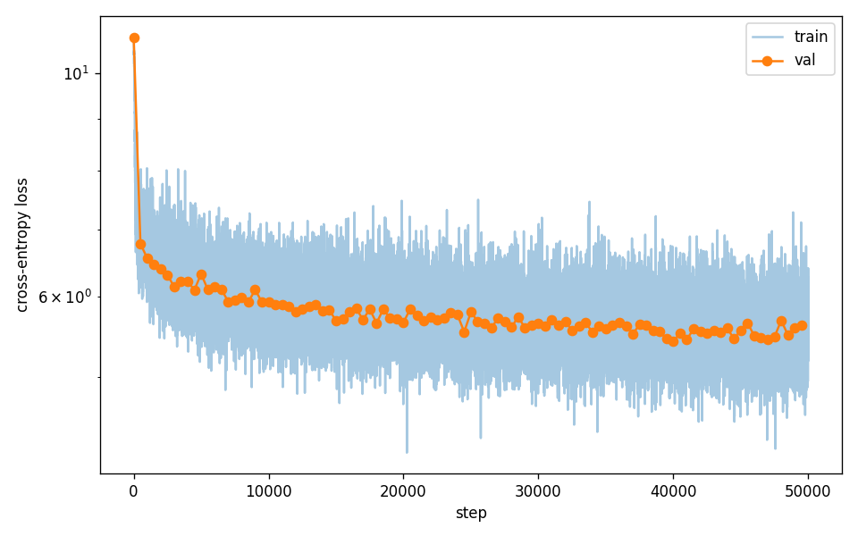
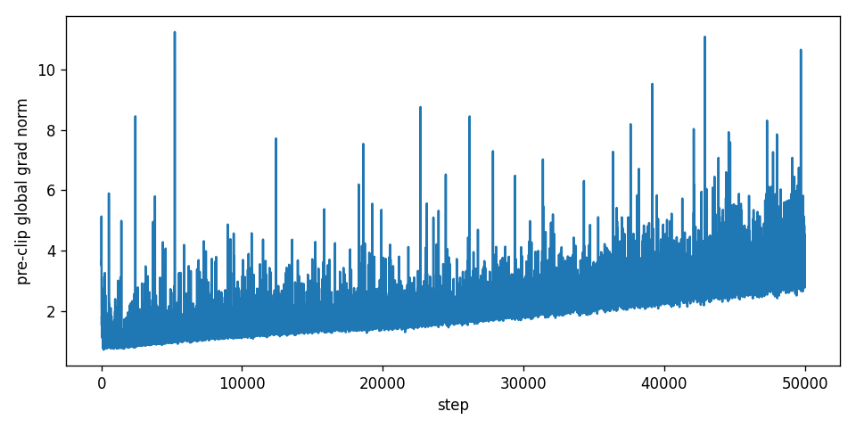
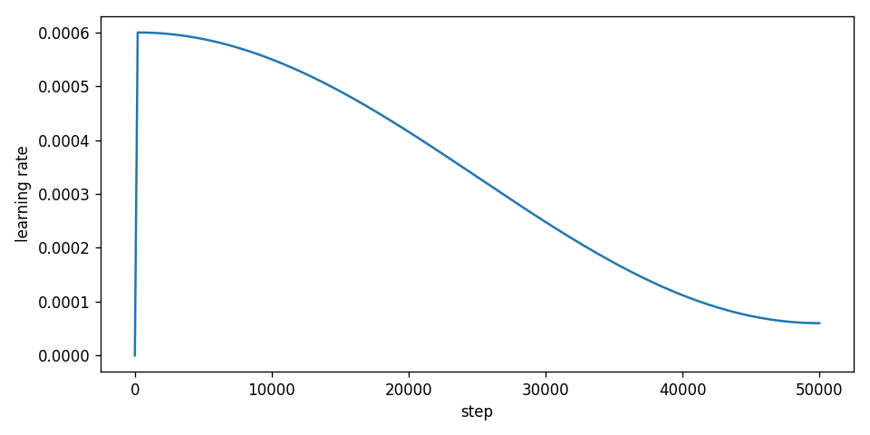

# rmk

A from-scratch implementation of a GPT-2-style decoder-only transformer **without using torch or jax autograd**. The autograd engine, every layer, and every gradient are implemented by hand on top of NumPy (and CuPy, for GPU training).

For the full writeup — approach, derivations, training runs, eval — see **[REPORT.md](REPORT.md)**.


## Results

| Dataset | Eval PPL ↓ | Reference (GPT-2 124M) |
|---|---|---|
| OpenWebText held-out val | **258** | ~17 |
| WikiText-103 val (BPE) | **1,140** | ~25 |

12.4M-param GPT, 51M tokens trained on the RTX 4050 in 7h45m.

### Training curves (OWT, 50K steps)

**Loss (train + val)**



**Pre-clip global gradient norm**



**Learning rate (cosine + warmup)**



Three visible phases: warmup descent (0-1K), mid-training plateau at ~5.9 (3K-20K), late-LR-decay descent to the val_loss minimum of **5.42 at step 40,000** (PPL 225). Schedule slightly overshot — `ckpt_step40000.npz` is the deployed model.

### Sample generation (OWT model, prompt `"The "`)

> *"The urulamidar is the author and that was the most successful. But this week had been a large 'dass' of it. The one with the most dangerous and its own. This is a good thing: the film of the same thing. 'It's not something that's not a big, but,' said Chriso. 'I think it's only a bit more often than you're going to the point that I'm not going to do it.'"*

Full sample: [`assets/owt_full50k/samples.txt`](assets/owt_full50k/samples.txt). The model learned the *shape* of OWT (English clauses, dialogue patterns, news-register topic clusters) but not the *substance* — typical of an undertrained model at this scale.

### Limitations (and why)

- **Token-undertrained** (4.1 tok/param vs Chinchilla's ~20): rare BPE rows barely moved from init. The single biggest constraint on PPL.
- **Effective batch = 1024 tokens** (B=4, T=256): noisy single-batch gradients; grad norms drift upward over training. Fix is gradient accumulation — would give the cheapest perplexity improvement.
- **Embedding-dominated architecture**: 78% of params live in `wte`; only ~21% do transformer work. Structural at this model size.
- **~5-15× slower than PyTorch** at the same scale: no kernel fusion (each LayerNorm = 6 separate kernels), no Flash Attention (we materialize the `(B, nh, T, T)` attention matrix), Python-level op dispatch overhead.
- **No mixed precision**: fp32 throughout to keep the autograd numerically clean. fp16/bf16 with loss scaling would double throughput at no quality cost.

See [REPORT.md §7](REPORT.md#7-limitations-and-future-work) for the full discussion.

## Layout

```
rmk/                      autograd engine + ops + model + training + eval
├── backend.py            xp = numpy | cupy, configurable dtype
├── tensor.py             Tensor + topo-sort backward + ops (+ * @ ...)
├── functional.py         gelu, layer_norm, softmax, embedding (fused, hand-derived backward)
├── losses.py             cross_entropy (fused softmax + CE, p−y collapse)
├── nn.py                 Module base + Linear / Embedding / LayerNorm / Dropout / ModuleList
├── transformer.py        MLP, MultiHeadAttention (causal), Block (pre-LN)
├── model.py              GPT + GPTConfig (weight-tied LM head, scaled residual init)
├── optim.py              AdamW + cosine_with_warmup + clip_grad_norm
├── train.py              training loop, eval, checkpoint save/load
├── sample.py             autoregressive generation (temperature + top-k)
├── eval.py               sliding-window BPE perplexity
└── gradcheck.py          finite-difference gradient checker
scripts/                  prep + train + eval entrypoints
runs/                     training artifacts (loss plots, checkpoints, samples)
```

## Setup

```powershell
python -m venv .venv
.venv\Scripts\Activate.ps1
pip install -r requirements.txt
# for GPU training:
pip install cupy-cuda12x
```

## Reproducing the runs

```powershell
# Data prep (~5 min each)
python scripts/prepare_shakespeare.py
python scripts/prepare_openwebtext.py
python scripts/prepare_wikitext.py

# TinyShakespeare on CPU (~7 hr)
python -u scripts/train_shakespeare.py --max-steps 2000 --name full2000

# OpenWebText on GPU (~7.5 hr on RTX 4050)
$env:RMK_BACKEND='cupy'
python -u scripts/train_owt.py --max-steps 50000 --name full50k

# Evaluate
python scripts/eval.py --ckpt runs/owt/full50k/ckpt_step40000.npz --dataset wikitext
python scripts/eval.py --ckpt runs/owt/full50k/ckpt_step40000.npz --dataset owt
```
