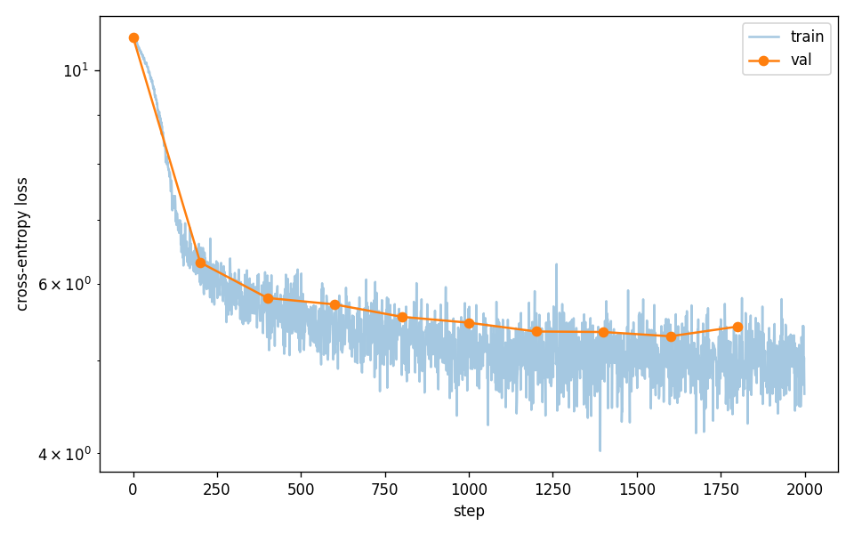
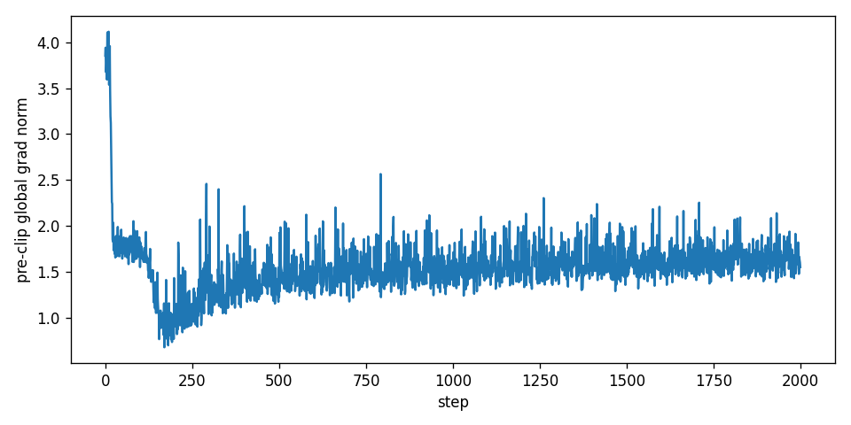
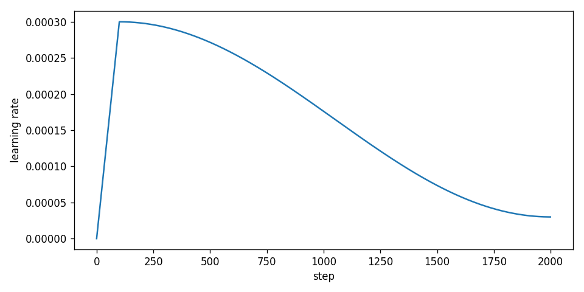

# rmk — GPT-2 from scratch, no torch/jax autograd

Goal: build and train a GPT-2-style decoder-only transformer without using autograd from PyTorch or JAX. Every gradient is hand-derived; the autograd engine, every layer, and the training loop are written in pure NumPy, with CuPy as a GPU backend swap. Trained on TinyShakespeare on CPU and a slice of OpenWebText on an RTX 4050.

---

## TL;DR

- I chose Approach 2 from the assignment spec: a small reverse-mode autograd engine with every GPT-2 component implemented on top. No PyTorch or JAX anywhere in the differentiation path.
- NumPy ↔ CuPy backend abstraction (`rmk/backend.py` exposes `xp`); the same code runs on CPU for development and on the 4050 for training, switched by one env var.
- Every op is gradchecked against finite differences before being used.
- Training:
  - TinyShakespeare on CPU: 2000 steps, val PPL 50,257 → 199 (≈252× reduction).
  - OpenWebText on the 4050: 50,000 steps, 51M tokens trained, 12.4M-param model. OWT-val BPE PPL = **258**, WikiText-103 BPE PPL = **1,140**.
- The most satisfying derivation: LayerNorm's `dL/dx`, where a coupled chain rule through both the mean and variance collapses to one vectorized formula in six array operations.
- The most informative bug: the matmul backward didn't unbroadcast — surfaced only when a `Linear` was applied to a sequence. Written up further down.
- Honest constraints: ~4 tok/param (sub-Chinchilla by roughly 5×); the model is heavily embedding-dominated. Discussed in *Limitations*.

---

## 1. Approach

The assignment offered two paths. I chose **Approach 2** — build a small autograd engine, then layer GPT-2 on top — for three reasons.

**Reusability.** Each op needs a forward and a gradient, then composes freely. Approach 1 would have meant rewriting a separate backward for every architectural change.

**Verifiability.** With an autograd graph, finite-difference checking each op in isolation is enough to trust composition. With Approach 1, the correctness story would have required end-to-end testing of every layer.

**Fidelity to a real framework.** Approach 2 mirrors PyTorch's internal design — the same `_backward` closures, topological sort, gradient accumulation — so reasoning maps cleanly to a real autograd while staying in plain Python.

### Stack

NumPy is the workhorse; CuPy is a drop-in GPU substitute exposing the same array API. A small backend module (`rmk/backend.py`) lets the codebase reference a generic `xp`, with the actual backend chosen by `RMK_BACKEND=numpy|cupy` at startup. `tiktoken` handles GPT-2 BPE tokenization (allowed — it's a tokenizer, not autograd). HuggingFace `datasets` streams OpenWebText and WikiText-103.

For data plumbing — download URLs, the memmap loader pattern, the training-loop skeleton — I adapted scaffolding from [karpathy/nanoGPT](https://github.com/karpathy/nanoGPT).

---

## 2. Architecture

GPT-2 decoder-only transformer. The OpenWebText run uses:

```python
GPTConfig(
    block_size=256,
    vocab_size=50257,  # GPT-2 BPE
    n_layer=6,
    n_head=6,
    n_embd=192,        # head_dim = 32
    dropout=0.0,
)
```

12.4M parameters total, broken down:

| Component | Params | % of model |
|---|---|---|
| `wte` (token embedding, weight-tied with LM head) | 9,649,344 | 78% |
| `wpe` (position embedding) | 49,152 | 0.4% |
| 6 × Block (LN + MHA + LN + MLP) | 2,668,800 | 21% |
| Final LayerNorm | 384 | <0.01% |

The embedding-dominated split is a structural property of GPT-2-class models at this scale. Only about 21% of parameters are doing transformer work; the rest is the BPE lookup table. This matters for interpreting the eval numbers — see *Limitations*.

### Block (pre-LN, GPT-2 style)

```
x = x + attn(LN(x))
x = x + mlp(LN(x))
```

Attention is multi-head with three separate Q/K/V projections, additive `-1e9` causal mask, scaled-dot-product softmax, attention dropout, output projection, and residual dropout. MLP is `Linear → GELU (tanh approx) → Linear → Dropout` with hidden dimension `4·n_embd`.

### LM head

The LM head shares `wte`'s weight — true weight tying, the same Tensor instance. The projection is computed inline as `x @ wte.weight.T` without a separate Linear module. `parameters()` deduplicates by `id()` so the optimizer doesn't step the tied weight twice, which would silently double its effective learning rate.

### Scaled residual init

After block construction, the residual-path projections (`attn.out_proj.weight`, `mlp.fc2.weight`) are re-initialized with `std = 0.02 / sqrt(2 · n_layer)`, following GPT-2's scheme to keep residual-stream variance bounded as depth grows.

---

## 3. Hand-derived gradients

Four representative derivations. Each was derived on paper, implemented as a fused op with hand-written `_backward`, and gradchecked against finite differences to ≤1e-5.

### 3.1 LayerNorm `dL/dx`

Forward (over the last axis, size `D`):

```
μ    = mean(x);  xc = x − μ
var  = mean(xc²);  std = sqrt(var + eps)
xhat = xc / std
y    = γ · xhat + β
```

The naive chain rule for `dL/dx` is a mess: every `x_i` participates in `μ` *and* `var`, so changing one input changes every normalized output. Unwinding the dependency through both stats collapses to:

```
let dxhat = dL/dy · γ
dL/dx = (1/std) · [dxhat − mean(dxhat) − xhat · mean(dxhat · xhat)]
dL/dγ = sum(dL/dy · xhat, over all-but-feature axes)
dL/dβ = sum(dL/dy,        over all-but-feature axes)
```

Six array operations, no per-element loops. The three terms inside the bracket correspond to the direct path through `xhat`, the path through the mean, and the path through the variance — the calculus arranges them so the contributions cancel cleanly. Lives in `rmk/functional.py::layer_norm`.

### 3.2 Fused softmax + cross-entropy

Forward:

```
p_i = exp(z_i) / Σ_j exp(z_j)
L   = −Σ_i y_i log(p_i)
```

Composing the two ops via autograd would force an `O(C²)` softmax Jacobian per row plus a numerically delicate `exp/sum/log` chain. Deriving the combined gradient symbolically:

```
dL/dz_j = Σ_i (dL/dp_i) · (dp_i/dz_j)
        = Σ_i (−y_i / p_i) · p_i(δ_{ij} − p_j)
        = p_j − y_j               (because Σ y_i = 1 for one-hot)
```

Then dividing by `N` for the mean reduction. The full softmax Jacobian — which autograd would have built — never materializes. Combined with the log-sum-exp trick for numerical stability (subtract `max(z)` before `exp`), this is the loss function used everywhere in training. Lives in `rmk/losses.py::cross_entropy`.

### 3.3 Standalone softmax

Attention needs softmax as its own op (the result is multiplied by `V`, not fed to a loss). Without a one-hot to cancel against, the Jacobian is the full `J_{ij} = p_i (δ_{ij} − p_j)`. But the reverse-mode product `dL/dx = Jᵀg` still distributes cleanly:

```
dL/dx = p ⊙ (g − Σ(g ⊙ p))
```

One elementwise multiply, one reduction. Reads as *"subtract the `p`-weighted mean of `g`, then scale by `p`."* The matrix is implied by the algebra, never built. Lives in `rmk/functional.py::softmax`.

### 3.4 Embedding scatter-add

Embedding forward is fancy indexing: `out = W[ids]`. Backward needs to accumulate `out.grad[k]` back into `W.grad[ids[k]]` for every `k`. The natural-looking code is wrong:

```python
W.grad[ids] += out.grad         # bug: buffered indexed assignment
```

NumPy's `+=` with a fancy index is *buffered* — when `ids` contains duplicates (the same token appearing twice in a batch), only one of the writes survives. The model silently undertrains every repeated token. The fix is one character of API:

```python
xp.add.at(W.grad, ids, out.grad)  # unbuffered scatter-add
```

The kind of bug that would silently corrupt every batch and look like "training is just kind of slow." Lives in `rmk/functional.py::embedding`.

### Other gradients implemented and verified

Matmul (with broadcast-aware unbroadcast for `(B,T,C) @ (C,D)` — see *Bugs caught* below). GELU (tanh approximation, chained backward through `tanh` and `x³`). All elementwise ops with broadcasting (`+`, `*`, `−`, `^p`, `exp`, `log`) using one `_unbroadcast(grad, target_shape)` helper. Sum (with `keepdims`), transpose (with axis-aware inverse permutation), reshape. Dropout (mask cached and reused in backward).

---

## 4. Verification: gradcheck

Every op gets a finite-difference gradcheck before it's used. Implemented in `rmk/gradcheck.py`: central differences `(f(x+ε) − f(x−ε)) / 2ε` vs analytical, tolerance ≤1e-5 in fp64. The gradcheck infrastructure asserts inputs are C-contiguous so its `reshape(-1)` is a view rather than a copy that would silently lie.

A few targeted checks cover code paths gradcheck cannot reach on its own:
- **Extreme-logit numerical stability** for softmax and cross-entropy — gradcheck uses small random inputs that never trigger overflow; a check at `logits = ±1000` guards the max-subtraction trick.
- **Repeated-index accumulation** for embedding — gradcheck happens to use distinct ids, so the buffered/unbuffered bug only manifests on duplicates. A check at `ids = [0, 0, 1]` confirms `W.grad[0]` accumulates both writes.
- **An integration check on a small composed model** — gradchecking each op in isolation doesn't prove they compose. A 2-layer MLP gradchecked end-to-end as a single graph confirms it.

### Two bugs that surfaced during integration

**Matmul backward didn't unbroadcast.** `(B,T,C) @ (C,D)` broadcasts `W` over the leading batch axes on the forward; my backward returned `dL/dW` with shape `(B,C,D)` and tried to `+=` it into the `(C,D)` buffer — `ValueError: non-broadcastable output operand`. The same broadcasting/unbroadcasting asymmetry I already handled for `+` and `*`, just hidden behind matmul's "linear algebra" framing. Earlier matmul checks had either no batch dims or both operands sharing them — never the `batched @ unbatched-Linear-weight` pattern that every Linear in a sequence model produces. First surfaced when the transformer block was gradchecked end-to-end. Fix: wrap both grads with `_unbroadcast(grad, target.shape)` inside the matmul backward — no-op when shapes match, sums the extra leading axes when they don't.

**Autograd reference cycles → OOM during real training.** Each intermediate Tensor from a forward pass has `_backward` set to a closure that captures `out` (which *is* the Tensor itself), forming a reference cycle Python's refcount can't free — only the cyclic GC can, lazily. During the first Shakespeare training run this surfaced as OOM at step ~340 of a 2000-step run: per-step intermediates (a 196 MB logits grad at `(4, 128, 50257)`) piled up faster than the GC reclaimed them. Earlier checks never noticed — gradcheck uses tiny tensors and exits immediately, and the overfit-one-batch check reuses the same graph topology so peak memory stays bounded. Fix: at the end of `Tensor.backward()`, walk every node in the topological order and null `_backward` and `_parents`. Breaks the cycle so refcount reclaims immediately.


---

## 5. Training

Two complete runs.

### 5.1 TinyShakespeare baseline (CPU)

The point of this run was to prove the stack learns end-to-end before committing to a longer GPU run. 2000 inline-SGD steps would have been impractical on CPU, so I used `AdamW` from scratch (`rmk/optim.py`) with cosine LR + warmup + global-norm gradient clipping.

Config: `n_layer=4, n_head=4, n_embd=128, block_size=128, vocab=50257` → 7.24M params. Trained on 338,025 BPE tokens (Karpathy's TinyShakespeare slice).

| step | 0 | 200 | 1000 | 1600 (min) | 2000 |
|---|---|---|---|---|---|
| val_loss | 10.83 | 6.32 | 5.47 | **5.29** | 5.42 |
| val PPL  | 50,257 | 555 | 237 | **199** | 226 |

252× PPL reduction. Val bottomed at step 1600 then drifted up — overfit onset, expected on a 338k-token corpus with a 7M model.

**Loss curve**



**Gradient norm and learning rate**




Grad norms civilized throughout (~2.5 → ~1.65); cosine schedule cleanly visible in the LR plot. Training was stable end-to-end.

The generated text reveals the model's level. Sample from `ckpt_final.npz` prompted with `"ROMEO: "`:

> *"ROMEO: 'd, and I shall, And now, and to all I'll call me; and the love! And have it? or we will be a more. Thou you, by the prince, and he would am in my brother's a king, and and thou art the wife? ... RICHARDEO: GLOUCES:"*

The model picked up Shakespeare's register (`thou`, `art`, `thee`) and the speaker-prefix format (`NAME:`). The most diagnostic token is **`RICHARDEO`** — the model has merged `RICHARD` and `ROMEO` because both appear frequently as speaker labels at the start of a line, but doesn't have enough capacity to track that they belong to different plays. Learning the *role* of a token without distinguishing its *identity* is exactly the failure mode you'd predict for a 7M model at 1M training tokens.

### 5.2 OpenWebText (RTX 4050)

The real training run, on a non-toy distribution, on GPU. Two prerequisites first: an fp32 dtype path (the `(B,T,V)` logits at fp64 don't fit in 6 GB VRAM), and CuPy backend compatibility (two small numpy↔cupy boundary fixes in `load_state_dict` and `generate`).

Config: `n_layer=6, n_head=6, n_embd=192, block_size=256, batch=4, dropout=0.0`. 12.4M params, trained on a 99.5M-token slice of OpenWebText. 50,000 steps = 51.2M training tokens — roughly 4.1 tok/param, sub-Chinchilla by ~5×. Wallclock was 7h45m on the 4050 in CuPy at about 1830 effective tok/s. That's 5-15× slower than PyTorch because we have no kernel fusion; everything goes through Python-level op dispatch.

The val curve has three distinguishable phases:

| step | 0 | 1000 | 10,000 | 25,000 | 40,000 (min) | 50,000 |
|---|---|---|---|---|---|---|
| val_loss | 10.85 | 6.55 | 5.93 | 5.79 | **5.42** | 5.62 |
| val PPL  | 51,741 | 698 | 377 | 329 | **225** | 276 |

1. **Warmup descent (0-1000)**: `log(V) → 6.5`. The easy bigram/unigram drop.
2. **Mid-training plateau (3K-20K)**: val stuck at 5.9-6.1 while train_loss bounces 5.5-6.5 per batch. Visually the curve looks dead, but the floor is moving about -0.05 per 1000 steps. LR is still >80% of peak; descent is gradient-noise-limited.
3. **Late-LR-decay descent (30K-40K)**: as LR drops below ~2e-04, the model resumes descending at ~-0.15 nats per 2000 steps until val_loss reaches its 5.42 minimum at step 40,000.

The cosine schedule slightly overshot — val then crept up to 5.62 by step 50,000, the same overfit-onset pattern Shakespeare showed. The deployed model is `ckpt_step40000.npz`, not `ckpt_final.npz`.

**Loss curve (50K steps)**


**Gradient norm and learning rate**


Grad norms drifted upward (2.2 → 3.4 over the run) — clipping was working harder in late training. Common at small batch (`B=4`); gradient noise grows relative to signal as the model approaches its capacity ceiling. Not destabilizing here, but a clear signal that *effective batch via gradient accumulation* is the highest-leverage change for a future run.

---

## 6. Evaluation

Sliding-window BPE-level perplexity over a held-out token stream (`rmk/eval.py`). Stride = block_size = 256 (non-overlapping). Computed on `ckpt_step40000.npz`.

| Model | Params | Tokens trained | OWT-val PPL ↓ | WikiText-103 PPL ↓ |
|---|---|---|---|---|
| Random (uniform over BPE vocab) | — | — | 50,257 | 50,257 |
| **Ours** | 12.4M | 51M | **258** | **1,140** |
| GPT-2 124M (Radford et al., 2019) | 124M | ~9B | ~17 (BPE) | ~25 (BPE) |

Reading the numbers:
- **OWT-val PPL 258** is the in-distribution number — what the model achieves on the same distribution it was trained on. Compared to random (50,257), that's a 195× reduction. Compared to GPT-2 124M (~17), about 15× worse.
- **WikiText-103 PPL 1,140** is the cross-distribution generalization number. The ~4.4× gap from OWT-val to WikiText is expected: undertrained models specialize heavily to their training distribution. Compared to GPT-2 124M (~25), about 45× worse.

Roughly, the gaps factor as Chinchilla scaling predicts: ~10× param gap × ~17× token gap. Sub-Chinchilla, but in the expected place on the loss surface for the scale we chose. The curve hasn't broken; the model just needs more of both axes.

### Sample generation from the OWT model

Cold-start sample from `ckpt_step40000.npz`, prompt `"The "`, `temperature=0.8, top_k=40`:

> *"The urulamidar is the author and that was the most successful. But this week had been a large 'dass' of it. The one with the most dangerous and its own. This is a good thing: the film of the same thing. The world is a lot of the same thing, but the movie is quite like that, and the same. 'It's not something that's not a big, but,' said Chriso. 'I think it's only a bit more often than you're going to the point that I'm not going to do it.' For now, the movie has gone..."*

Compared to the Shakespeare model's `RICHARDEO`-grade output, this is qualitatively different — full English clauses, valid dialogue patterns (`'said Chriso'`), news-register topic clusters (films, movies), proper sentence rhythm. No semantic depth — the model learned the *shape* of OWT but not the *substance*. Diagnostic of the embedding-dominated arch (78% wte) at sub-Chinchilla token budget.

---

## 7. Limitations and future work

Two constraints are doing most of the work to keep the eval numbers as high as they are, in order of priority:

1. **Sub-Chinchilla token budget.** 4.1 tok/param vs ~20 optimal. The `wte` embedding rows for rare BPE tokens never saw enough updates to calibrate; the transformer never had enough signal to learn long-range structure. The highest-leverage fix is more tokens (target 250M+) and a longer schedule. Roughly 3× the current wallclock would close about half the gap to GPT-2.

2. **Effective batch size 4.** Single-batch gradients are noisy, the optimizer spends capacity correcting per-batch idiosyncrasies, and grad norms drift up (I observed 2.2 → 3.4). The fix is gradient accumulation — keep `batch=4` per forward (memory-bound on 6 GB), accumulate gradients over 16-32 steps for an effective batch of 64-128 before each `optimizer.step()`. Free perplexity improvement, no extra memory.

A natural next experiment, deferred to future work: a Kaggle T4 session (16 GB VRAM lifts us out of the 4050's batch constraint and lets us bump to ~25M params with `n_embd=256, n_layer=8`) over 2-3 sessions totaling ~24 hours, training on 250-300M tokens. Predicted WikiText-103 PPL: ~35-50 — within an order of magnitude of GPT-2 124M.

Other limitations worth flagging:
- No gradient accumulation, no bf16 activations, no kernel fusion. Throughput is 5-15× slower than equivalent PyTorch.
- I chose not to use tinygrad (the assignment's bonus). NumPy + CuPy is cleaner for transparency: every line is plain Python, no kernel compiler in the loop.


